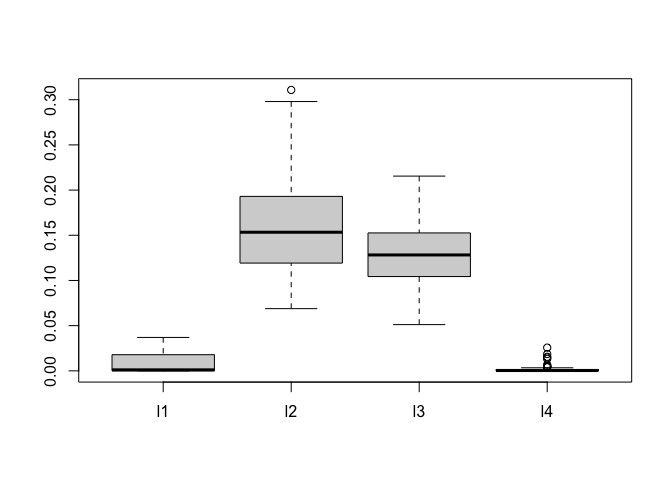

<!-- README.md is generated from README.Rmd. Please edit that file -->

# bark: Bayesian Additive Regression Kernels

<!-- badges: start -->

[](https://github.com/merliseclyde/bark/actions)
[](https://app.codecov.io/gh/merliseclyde/bark)
[](https://bestpractices.coreinfrastructure.org/projects/7096)
<!-- badges: end -->

The bark package implements estimation for a Bayesian nonparametric
regression model represented as a sum of multivariate Gaussian kernels
as a flexible model to capture nonlinearities, interactions and feature
selection.

## Installation

You can install the released version of bark from
[CRAN](https://CRAN.R-project.org) with:

``` r
install.packages("bark")
```

And the development version from
[GitHub](https://github.com/merliseclyde/bark) with:

``` r
require("devtools")
devtools::install_github("merliseclyde/bark")
```

## Example

``` r
library(bark)
set.seed(42)
traindata <- sim_Friedman2(200, sd=125)
testdata <- sim_Friedman2(1000, sd=0)
fit.bark.d <- bark(y ~ .,  
                   data=data.frame(traindata), 
                   testdata = data.frame(testdata),
                   classification=FALSE, 
                   selection = TRUE,
                   common_lambdas = FALSE,
                   printevery = 10^10)

mean((fit.bark.d$yhat.test.mean-testdata$y)^2)
#> [1] 1738.992
```

bark is similar to SVM, however it allows different kernel smoothing
parameters for every dimension of the inputs $x$ as well as selection of
inputs by allowing the kernel smoothing parameters to be zero.

The plot below shows posterior draws of the $\lambda$ for the simulated
data.

``` r
boxplot(as.data.frame(fit.bark.d$theta.lambda))
```



The posterior distribution for $\lambda_1$ and $\lambda_4$ are
concentrated near zero, which leads to $x_1$ and $x_2$ dropping from the
mean function.
